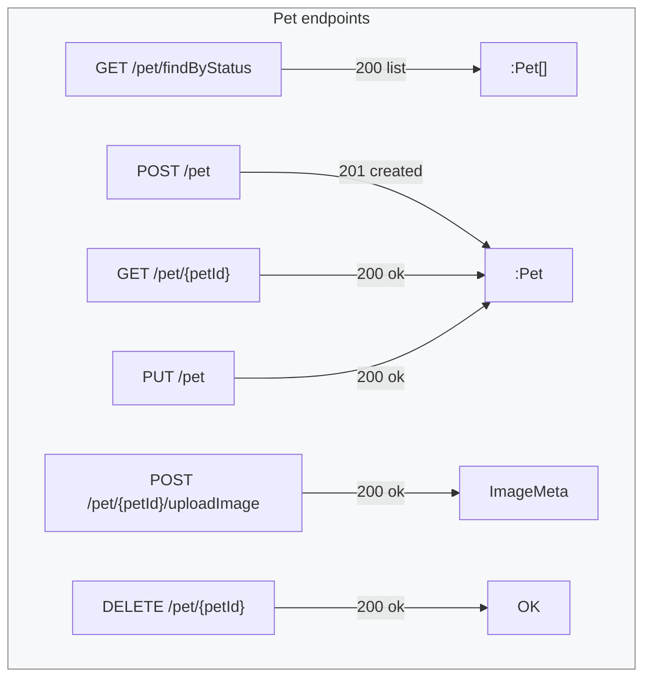

Below is a ready-to-paste **Markdown** chunk that gives you a short textual tour of the PetStore sample **plus** a Mermaid diagram that renders cleanly (no parse errors).
Drop it into GitHub-flavoured Markdown, MkDocs, Docusaurus, or the [Mermaid Live Editor](https://mermaid.live) to preview.

---

## PetStore API at-a-glance

The classic PetStore reference is split into three functional areas:

| Domain    | Key Paths (examples)                        | Typical Ops                     |
| --------- | ------------------------------------------- | ------------------------------- |
| **Pet**   | `/pet`, `/pet/{petId}`, `/pet/findByStatus` | Add, update, list, upload image |
| **Store** | `/store/order`, `/store/inventory`          | Order lifecycle, stock levels   |
| **User**  | `/user`, `/user/{username}`, `/user/login`  | Account CRUD, login/logout      |

All endpoints are JSON-based and respect standard REST verbs (`GET`, `POST`, `PUT`, `DELETE`), with optional API-key or OAuth 2 authentication in many tutorials.

---

### Mermaid overview

**Reading tips**

* **Left-hand nodes** are HTTP operations; **right-hand nodes** show the main success payload.
* The same payload node (e.g. `:Pet`) is reused by multiple operations.
* Distinct response-only nodes (`OK`, `status → qty`, etc.) keep the diagram tidy.

Feel free to extend the diagram as you add new endpoints or error flows—the Mermaid syntax above parses without errors and is easy to modify.
